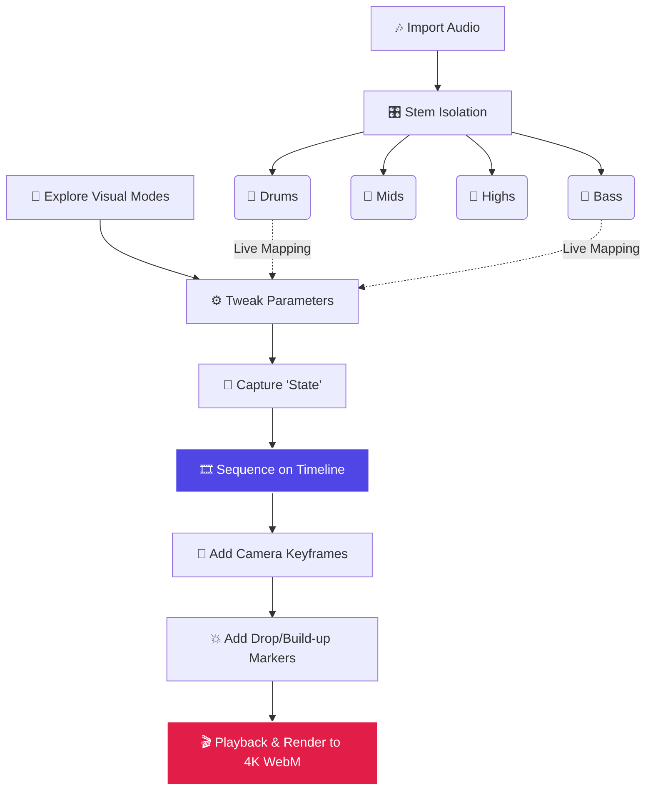

  <h1>🎵 AURA STUDIO</h1>
  
<strong>The Professional Cinematic Audio Visualization Engine</strong>

  
Create, Sequence, and Render Cinematic 3D Visuals from any Audio directly in your browser.

---

**AURA STUDIO** is a high-fidelity, real-time audio visualization suite. It transcends simple reactive visualizers by providing a **professional Non-Linear Editor (NLE)** timeline, an advanced **State Node Graph**, and a deterministic **Cinematic Camera Engine**. 

Whether you are performing live, producing music videos, or generating high-quality 4K renders, Aura gives you total creative control over how your music is seen.

---

## 🗺️ The Aura Workflow

Aura is built on a modular "State Snapshot" system. You capture specific visual configurations (Modes + Parameters), sequence them on a timeline, map audio stems to drive those parameters, and animate a camera through the 3D space.

---

## 🚀 Step-by-Step Guide: Creating a Cinematic Visual

### Step 1: Import Audio & Stems
1. Click the **Load Audio** button at the top to upload your master track.
2. Open the **Stem Manager** to optionally upload isolated stems (`Drums`, `Bass`, `Mids`, `Highs`). 
3. *Why Stems?* Stems allow you to drive specific visual parameters (like Camera Shake or Bloom) solely off the kick drum, while leaving the high-frequency melodies to drive particle speeds.

### Step 2: Build Your Visual States
1. Press `Tab` to open the **Library** and select from the **24 highly curated Visual Modes**.
2. Press `P` to open the **Parameters Panel**. Adjust colors, particle counts, and geometry complexities.
3. Right-click any parameter to enable **Live UI Mapping** — automatically link a slider to an audio stem or frequency band!
4. Once you have a look you like, click **Capture State** (or `Add to Timeline`). This saves your exact configuration as a concrete block.

### Step 3: Sequence the NLE Timeline
Aura features a professional, multi-track timeline at the bottom of the screen:
*   **Visual Track:** Drag and drop your captured States onto the timeline. **Overlap two states** to automatically create a smooth crossfade blend between entirely different shaders and geometries.
*   **Camera Track:** Position the camera where you want it using Orbit or WASD, then click **Capture Cam KF**. The engine will interpolate between your keyframes using Smooth, Spline (Catmull-Rom), or Step easing.
*   **Marker Track:** Press `M` to drop a section marker. Change its type to `Intro`, `Build-up`, `Fakeout`, `Drop`, `Fill`, or `Outro`. **Aura's audio engine is section-aware**; it will read these markers and multiply visual intensity (shake, flash, bloom) based on the current song section.

### Step 4: The Node Graph (Advanced Routing)
Press `N` to open the **State Node Graph**. Move beyond simple linear A-to-B timeline transitions. You can route multiple visual states together through mathematical blending nodes, triggered conditionally by audio transients.

### Step 5: Render Your Masterpiece
1. Press `R` to start recording. 
2. Aura leverages the native `MediaRecorder API` to capture your visuals.
3. Configure your export bitrate in Global Settings (up to **Max Quality 100Mbps** for crisp 4K output).
4. Save your `.aura.json` project file to retain your entire timeline, keyframes, and parameter mappings for future sessions.

---

## 🎥 Camera Control System

Aura has three distinct camera interaction models to ensure you always have the right angle:

*   **⊙ Orbit Mode:** Smooth, mouse-driven orbital controls around the scene origin. Perfect for exploring modes and finding the right composition.
*   **✈ Free Move Mode (WASD):** First-person fly-through controls. Use `W/A/S/D` to navigate 3D space, capturing dynamic, manual angles.
*   **⏵ Follow Mode:** Locks the camera to the deterministic keyframe track on the timeline. *Required for timeline playback and final rendering.*

---

## 🌌 The 24 Curated Visual Modes

Aura has been heavily refined and currently ships with **24 highly optimized** WebGL/Three.js visual modes:

| Category | Modes |
| :--- | :--- |
| **Core Audio** | `Frequency Bars`, `Waveform Scope`, `Spectrogram`, `Radial Bloom`, `Lissajous` |
| **Geometry** | `Geometry Shapes 2`, `Rhythmic Geometry`, `Hyperforge 3`, `Titanforge`, `Möbius Rings` |
| **Cosmic/Sim** | `Void Engine` (Black Hole), `Starfield`, `GPGPU Particles`, `Fractal Tree`, `Math Mode`, `Cyber Grid` |
| **Abstract** | `Particle Storm`, `Particle Manipulation`, `Terrain Mesh`, `Kaleidoscope`, `Shader Tunnel`, `Neon Plasma`, `Voronoi Field`, `Grid Distortion` |

---

## ⌨️ Keyboard Shortcuts

| Shortcut | Category | Action |
| :--- | :--- | :--- |
| `Space` | **Playback** | Play / Pause |
| `L` | **Playback** | Toggle Loop Mode |
| `← / →` | **Playback** | Seek timeline ±5 seconds |
| `↑ / ↓` | **Playback** | Master Volume Up / Down |
| `W/A/S/D` | **Camera** | Free Fly Camera (Move Mode only) |
| `Drag` | **Camera** | Look around (Move/Orbit Modes) |
| `M` | **Timeline** | Add Section Marker at Playhead |
| `Ctrl+Wheel`| **Timeline** | Zoom Timeline Scale |
| `Wheel` | **Timeline** | Pan Timeline horizontally |
| `Del / Bksp`| **Timeline** | Delete Selected Clip / Keyframe / Node |
| `Ctrl+Z / Y`| **Timeline** | Undo / Redo timeline edits |
| `Tab` | **UI** | Toggle Library Panel |
| `P` | **UI** | Toggle Parameters Panel |
| `N` | **UI** | Toggle State Graph Panel |
| `1–9` / `[ ]`| **UI** | Quick switch visual modes |
| `F` | **Effects** | Trigger Manual Beat Flash overlay |
| `R` | **Export** | Start / Stop Video Recording |
| `G` | **UI** | Toggle Fullscreen |
| `Ctrl+S` | **Export** | Take High-Res Screenshot |
| `` ` `` (Backtick)| **Debug** | Toggle Engine Debug HUD |

---

## 🛠️ Tech Stack & Architecture

Aura is built for blistering performance with **zero bloated framework dependencies**:
*   **Three.js**: Drives the real-time 3D rendering pipeline, utilizing custom GLSL shaders and a comprehensive post-processing stack (Unreal Bloom, Luminosity High Pass, Tone Mapping).
*   **Web Audio API**: Handles advanced FFT spectral analysis, low-latency onset detection, and multi-track stem synchronization.
*   **MediaRecorder API**: Manages the native video export pipeline for capturing the WebGL canvas at high bitrates.
*   **Vanilla HTML/CSS/JS**: A modular, highly performant architecture utilizing native DOM elements and raw CSS variables for the glassmorphism UI.

---

## 🤝 Contributing

We welcome new visual modes and engine improvements! To add a new visualizer:
1. Fork the repo and create a new file in `js/modes/`.
2. Follow the standard mode interface (`init`, `update(audio, params, dt)`, `dispose`).
3. Add your mode to `index.html` and the `visualModes` registry in `js/visuals.js`.
4. Open a PR!!

---

  
Made with 🎵 and ✨ by <a href="https://github.com/theyeeetguyyy">theyeeetguyyy</a>

