# AURA — Procedural Cinematic Audiovisual Engine
# Architecture Roadmap & Engine Philosophy

---

## 0. Engine Identity Doctrine

> [!CAUTION]
> This section is **non-negotiable**. Every architectural decision, every system design, every line of code must serve this doctrine. If a change does not advance this vision, it does not belong in the engine.

### What AURA Is

AURA is a **procedural cinematic audiovisual operating system** specialized for:
- **Dubstep, tearout, riddim, aggressive bass music**
- **Cinematic music-directed content**
- **Vertical 9:16 audiovisual experiences** (Instagram, YouTube Shorts, TikTok)

### What AURA Is NOT

- A generic audio visualizer
- A frontend web app
- An FFT→bars waveform toy
- A "template-based" content generator

### The Target

**Music-directed cinematography.**

The engine must eventually understand:
| Musical Input | Visual Translation |
|---|---|
| Musical intent | Camera language |
| Musical structure | Scene choreography |
| Musical aggression | Visual density & motion intensity |
| Musical tension | Pressure, compression, instability |
| Musical resolution | Velocity release, spatial expansion |

### The Visual Identity

Visuals must feel:

| ✅ Target | ❌ Anti-target |
|---|---|
| Violent | Generic |
| Massive | Minimal |
| Mechanical | Organic-soft |
| Alien | Familiar |
| Unstable | Smooth |
| Cinematic | "Screensaver" |
| Physically weighted | Floaty |
| Immersive | Flat |
| Pressurized | Ambient |

### Priority Stack
1. Cinematic quality
2. Music synchronization quality
3. Motion language
4. Architecture scalability
5. Realtime performance
6. Workflow quality
7. Maintainability
8. Code cleanliness

---

## 0.1 Stem-Routing Architecture (Foundational)

The engine's audio architecture must evolve toward **manual stem import** as the primary workflow.

**NOT** fully automatic stem separation. Manual stems preserve artistic intent and accuracy.

### Future Workflow
```
project/
  drums.wav      → Camera recoil, impact flashes, strobe, shake impulses
  bass.wav       → Geometry deformation, tunnel compression, pressure, displacement
  ambience.wav   → Fog, lighting drift, cinematic floating, volumetric behavior
  fx.wav         → Glitches, chromatic aberration, datamosh, distortion systems
  vocals.wav     → Typography, entity visuals, focus/framing shifts
  fills.wav      → Transition effects, pre-drop tension markers
```

### Semantic Detection Targets

The current semantic detection system (`gunShotDetected`, `tearoutLevel`, `sirenRising`, `wobbleLFO`, etc.) is **already strong**. Preserve and evolve it toward higher-order musical understanding:

| Detection | Category |
|---|---|
| Gun basses | Aggressive impact |
| Sustains | Pressure/weight |
| Reeses | Tension/movement |
| Stabs | Rhythmic punctuation |
| Glitches | Digital artifacts |
| Fills | Transitional energy |
| Fakeouts | Suspended tension |
| Transitions | Scene boundaries |
| Tension sections | Building pressure |
| Ambience | Environmental drift |
| Impacts | Kinetic release |
| Switchups | Pattern disruption |

---

## 0.2 Cinematic Camera Doctrine

The camera is one of the **most important future systems**. It must become a standalone cinematic direction system.

### Camera Physics Requirements
- FPV/drone-style movement
- Cinematic push-ins
- Recoil (spring-damper)
- Inertia
- Overshoot
- Damping
- Impact responses
- Velocity accumulation
- Cinematic floating
- Aggressive drop choreography

### Camera Feel: Heavy, Physical, Reactive, Alive

**NOT**: simple lerped transforms.

### Per-Event Camera Language
| Audio Event | Camera Response |
|---|---|
| Snare | Micro recoil |
| Gun bass | Aggressive forward impact lunge |
| Sustain | Slow heavy drift |
| Fakeout | Near-frozen suspended movement |
| Drop | Violent velocity release |
| Buildup | Increasing instability and tension |

---

## 0.3 Vertical 9:16 First-Class Architecture

9:16 composition is **first-class architecture**, not a cropped widescreen afterthought.

### Vertical Visual Direction
- Forward camera movement / tunnel motion
- Depth / aggressive Z-space movement
- Center-focused composition
- Vertical cinematic framing
- Layered depth planes (foreground particles, mid geometry, background volumetrics)

---

## 0.4 Scene Hierarchy Model (Future Target)

```
Song
  → Sections (intro, buildup, drop, breakdown, climax, outro)
    → Scenes (visual state snapshots)
      → Layers (simultaneous visual systems)
        → Systems (geometry, particles, volumetrics, post-fx)
          → Modulators (event-driven parameter animation)
            → Parameters (the actual values)
```

The current state system should evolve toward **Scene Snapshots** rather than simple presets.

### Future Timeline Features
- Automation curves
- Bezier easing
- Spline paths
- Cinematic transitions
- Nested scenes
- Grouped sections
- Parameter animation tracks
- Camera tracks
- Transition clips

### Future Graph System
The graph should evolve into a **modulation/event routing system**, NOT generic visual scripting.

```
EVENT_SNARE       → camera recoil
EVENT_GUNSHOT     → shockwave + lens distortion
Bass sustain      → tunnel deformation
Ambience level    → fog density
```

The graph becomes the **orchestration layer** between audio intelligence, events, modulation, camera, and rendering systems.

---

## 0.5 Multi-Layer Composition Vision

The engine must NOT think in "one active mode." It must evolve toward **multiple simultaneous layered visual systems**.

### Example Future Scene (All Active Simultaneously)
- Volumetric fog
- Particle debris
- Raymarched tunnel
- Attractor geometry
- Debris system
- Lens distortion
- Bloom with temporal memory
- Glitch layers
- Lighting systems

Future visuals emerge from **layer interaction and compositing**, not single isolated modes.

### Future Render Pipeline
- Render passes (per-layer framebuffers)
- Compositing (blend modes, masking)
- Temporal accumulation (motion blur, bloom memory)
- Feedback systems (visual echo, trail persistence)
- Post-processing stacks (chromatic aberration, film grain, glitch, distortion, volumetrics)

The quality ceiling depends on **temporal effects and compositing**, not polygon count alone.

---

## 0.6 Deterministic Export Pipeline Vision

Target: studio-quality exports for Instagram, YouTube Shorts, TikTok.

### Requirements
- Frame-accurate rendering (no `requestAnimationFrame` drift)
- High bitrate output
- Offline rendering (frame-stepping clock)
- Image sequence export capability
- Cinematic quality preservation at export resolution
- 9:16 native resolution support (1080×1920, 2160×3840)

---

## 1. Current System Topology

### File Map & Module Boundaries

```mermaid
graph TB
    subgraph "Entry"
        HTML[index.html]
        APP[app.js — Bootstrap & rAF Loop]
    end

    subgraph "Audio Intelligence"
        AUDIO[audio.js — 1447 LOC<br/>FFT, Band Decomposition, Onset,<br/>Beat Tracking, Semantic Detectors]
    end

    subgraph "Parameter System"
        PARAMS[params.js — 216 LOC<br/>Global/Mode Registry,<br/>Audio Modulation Mappings]
    end

    subgraph "Section System"
        MARKERS[markers.js — 273 LOC<br/>Timeline Markers, Section Behaviors,<br/>Chaos/Intensity Scaling]
    end

    subgraph "Rendering Engine"
        VISUALS[visuals.js — 897 LOC<br/>Three.js Scene, Camera, Post-Processing,<br/>Shake/Flash/Zoom, Orbit Control,<br/>Mode Registry, Timeline Application]
    end

    subgraph "Engine Modules"
        EVENTBUS[eventBus.js — Typed Events]
        MATHLIB[mathLib.js — Shared Math]
        COLORLIB[colorLib.js — Shared Colors]
    end

    subgraph "Visual Modes — 25 Loaded, 21 Registered"
        M1[hyperforge2.js — HyperforgeMode2]
        M2[hyperforge3.js — HyperforgeMode3]
        M3[titanforge.js — TitanforgeMode]
        M4[geometryShapes2.js — GeometryForgeMode2]
        M5[gpgpuParticles.js — GPGPUParticlesMode]
        M6[...17 more modes]
    end

    subgraph "Project System"
        SCHEMA[schema.js — 85 LOC]
        STORE[store.js — 186 LOC<br/>Reducer + Undo/Redo]
        SERIAL[serialize.js — 38 LOC]
    end

    subgraph "Graph System"
        GMODEL[graphModel.js — 48 LOC<br/>Easing, DeepBlend]
        GEVAL[graphEvaluator.js — 91 LOC<br/>NLE Clip Resolution]
        GUIGRAPH[uiGraph.js — 398 LOC<br/>SVG Node Graph]
    end

    subgraph "Timeline System"
        TMODEL[timelineModel.js — 21 LOC]
        TUITL[uiTimeline.js — 504 LOC<br/>Clip Editing, Waveform, Scrub]
    end

    subgraph "Studio UI"
        STATELIB[stateLibrary.js — 77 LOC]
        LAYOUT[layout.js — 65 LOC]
        UI[ui.js — 1366 LOC<br/>Panels, Transport, Keyboard,<br/>Mapping Modal, Debug HUD]
        REC[recorder.js — 100 LOC]
    end

    APP --> AUDIO
    APP --> VISUALS
    APP --> UI
    VISUALS --> M1
    VISUALS --> M2
    VISUALS --> M3
    VISUALS --> M4
    VISUALS --> PARAMS
    VISUALS --> MARKERS
    VISUALS --> GEVAL
    VISUALS --> STORE
    M1 --> MATHLIB
    M1 --> COLORLIB
    M1 --> EVENTBUS
    AUDIO --> EVENTBUS
    UI --> PARAMS
    UI --> AUDIO
    UI --> VISUALS
    UI --> TUITL
    UI --> GUIGRAPH
    UI --> STATELIB
    UI --> LAYOUT
    TUITL --> STORE
    TUITL --> GEVAL
    GUIGRAPH --> STORE
    STORE --> SCHEMA
    SERIAL --> STORE
```



### Frame Loop Architecture

```
requestAnimationFrame(loop)
  ├─ AudioEngine.update()           // FFT → Band Decomposition → Onset → Beat → Semantic Detectors
  │   ├─ Writes to audioBus (frozen data contract)
  │   └─ AuraEvents.emit()          // Typed events: BASS_IMPACT, GUNSHOT, DROP_ENTER, etc.
  │
  ├─ VisualEngine.update()
  │   ├─ GraphEvaluator.evalAtTime() // Timeline → NLE clip resolution → blended state
  │   ├─ applyBlendedState()         // Mode switch + param interpolation + camera blend
  │   ├─ updateEffects()             // Camera shake, zoom, flash, fog, exposure
  │   │   ├─ MarkerSystem behaviors  // Section-aware modulation
  │   │   └─ Orbit camera physics    // Manual orbit + cinematic overrides
  │   ├─ activeMode.update()         // Per-mode rendering (geometry, particles, shaders)
  │   │   └─ Uses MathLib/ColorLib   // Shared utilities (no more inline duplication)
  │   └─ composer.render()           // Post-processing (Bloom)
  │
  └─ UI.updateTransport()            // Time display, BPM, level meter, debug HUD
      └─ TimelineUI.update()         // Playhead position
```

---

## 2. Architectural Strengths — PRESERVE

### 2.1 The `audioBus` Data Contract
**Location**: [audio.js](file:///c:/Users/astit/Desktop/aura/js/audio.js)

The `audioBus` is a **masterpiece of engine design**. It acts as a read-only, pre-analyzed data bus that completely decouples audio analysis from visual consumption. Modes never touch the Web Audio API — they consume `audioBus.smoothBands.bass`, `audioBus.bassBeat`, `audioBus.gunShotDetected`, etc.

**What makes it excellent:**
- Zero-allocation: All buffers (`frequencyData`, `waveformPoints`, `rawBands`, `smoothBands`) are pre-allocated Float32Arrays
- Semantic richness: Beyond raw FFT, it provides `tearoutLevel`, `sirenRising`, `screechDetected`, `gunShotDetected`, `wobbleLFO` — dubstep-specific analysis
- Temporal smoothing: Multi-speed exponential smoothing per band prevents visual jitter
- Section awareness: `sectionEffects` object provides displacement/speed/bloom multipliers per section type

> [!IMPORTANT]
> **DO NOT refactor the audioBus into classes or ES modules.** Its current flat-object design is intentional for hot-path access. Property access on plain objects is faster than method calls on class instances in V8. This system should be extended with per-stem buses, not restructured.

### 2.2–2.11
*(Preserved from initial audit — zero-allocation hot paths, shared geometry pattern, GPU instancing, GPGPU particles, NLE timeline, reducer state, deep blend, section behaviors, mode interface contract, waveform peaks)*

---

## 3. Evolution Roadmap — 6 Phases

> [!IMPORTANT]
> Each phase is **non-breaking**. The engine remains functional after every phase. No "big rewrite" — iterative engine evolution. Every phase builds toward the cinematic operating system vision in Section 0.

### Phase 1: Event System & Shared Utilities ← **IN PROGRESS**
**Goal**: Eliminate per-mode duplication. Establish event-driven architecture. Create shared math/color libraries.

**Completed:**
- ✅ `js/engine/eventBus.js` — Zero-allocation typed event emitter
- ✅ `js/engine/mathLib.js` — Noise, FBM, superformula, 17 surfaces, 8 attractors, displacement builder
- ✅ `js/engine/colorLib.js` — 12 vertex color modes as hoisted closures
- ✅ Script tags added to `index.html`

**Remaining:**
- Migrate `hyperforge3.js` → use `MathLib.*`, `ColorLib.*`
- Migrate `hyperforge2.js` → use shared libraries
- Migrate `titanforge.js` → use shared libraries
- Migrate `geometryShapes2.js` → use shared libraries where applicable
- Wire `AuraEvents` into `AudioEngine` (emit typed events after analysis)
- Wire `AuraEvents` into `VisualEngine` (emit section/mode events)

---

### Phase 2: Cinematic Camera Engine
**Goal**: Standalone physically-weighted camera system. The camera becomes a **cinematic direction system**.

| Task | Details |
|---|---|
| **[NEW] `js/engine/cameraEngine.js`** | Spring-damper physics, stackable layers, inertia, mass, configurable profiles |
| **[MODIFY] `visuals.js`** | Extract all camera logic. VisualEngine delegates to `CameraEngine.update()` |

**Stackable Camera Layers:**
| Layer | Purpose | Driven By |
|---|---|---|
| `OrbitLayer` | User mouse interaction | Mouse/touch input |
| `ShakeLayer` | Section-driven camera shake | `AuraEvents.BEAT`, section chaos level |
| `ImpactLayer` | Bass recoil with spring recovery | `AuraEvents.BASS_IMPACT`, `AuraEvents.GUNSHOT` |
| `SplineLayer` | Keyframed cinematic paths | Timeline automation |
| `DriftLayer` | Slow cinematic floating | Ambience stem level |
| `PushLayer` | Forward Z-space movement (tunnel/FPV) | Drop intensity, bass sustain |

**Physics Model:**
```
// Spring-damper system (per-axis)
acceleration = (-stiffness * displacement - damping * velocity + externalForce) / mass
velocity += acceleration * dt
position += velocity * dt
```

**Per-Event Camera Language (Phase 2 target):**
```
EVENT_SNARE       → ImpactLayer.impulse({pitch: -0.02, recover: 0.15})
EVENT_GUNSHOT     → PushLayer.lunge({z: -3.0, spring: 0.8, damping: 0.3})
EVENT_BASS_IMPACT → ShakeLayer.burst({intensity: 0.5, duration: 0.2})
EVENT_DROP_ENTER  → DriftLayer.freeze() + PushLayer.release({velocity: 5.0})
EVENT_BUILDUP     → ShakeLayer.ramp({from: 0.01, to: 0.3, duration: sectionLength})
```

---

### Phase 3: Render Graph & Post-Processing Stack
**Goal**: Modular, stackable post-processing pipeline. Temporal effects. Compositing.

| Task | Details |
|---|---|
| **[NEW] `js/engine/renderGraph.js`** | DAG of render passes. Each pass: inputs (textures) → render → outputs (render targets) |
| **Built-in passes** | `ScenePass`, `BloomPass`, `ChromaticAberrationPass`, `FilmGrainPass`, `GlitchPass`, `DOFPass`, `MotionBlurPass`, `FXAAPass` |

**Stem-Driven Post-Processing:**
| Pass | Driven By |
|---|---|
| Chromatic aberration | FX stem / `AuraEvents.GUNSHOT` |
| Glitch/datamosh | FX stem intensity |
| Film grain | Section chaos level |
| Motion blur | Camera velocity magnitude |
| Bloom intensity | Bass stem energy |
| Lens distortion | Impact events |

---

### Phase 4: Stem-Aware Audio Router
**Goal**: Manual multi-stem import with per-stem independent analysis and event routing.

| Task | Details |
|---|---|
| **[MODIFY] `audio.js`** | Add `loadStems({drums, bass, ambience, fx, vocals, fills})`. Each stem → own `AnalyserNode` → own stem bus. Master `audioBus` remains as mixed-down fallback. |
| **[NEW] `js/engine/stemRouter.js`** | Maps stem buses to engine systems. Configurable routing table. |
| **[NEW] Stem import UI** | Multi-file drag-drop zone. Per-stem assignment. Stem waveform visualization on timeline. |

**Routing Architecture:**
```
stemRouter.route('drums',    [CameraEngine.ImpactLayer, FlashSystem, StrobeSystem])
stemRouter.route('bass',     [GeometryDisplacement, TunnelCompression, PressureSystem])
stemRouter.route('ambience', [FogSystem, LightingDrift, VolumetricBehavior])
stemRouter.route('fx',       [GlitchPass, ChromaticAberration, DatamoshPass])
stemRouter.route('vocals',   [TypographySystem, EntityVisuals, FocusFraming])
```

---

### Phase 5: Layer Compositor
**Goal**: Multiple visual systems running simultaneously with cinematic compositing.

| Task | Details |
|---|---|
| **[NEW] `js/engine/layerCompositor.js`** | Per-layer `WebGLRenderTarget`. Compositor pass blends with opacity, blend mode, stem-driven crossfade. |
| **[MODIFY] Mode lifecycle** | Modes become "Layer Sources." Multiple active. Each renders to its own framebuffer. |

**Example Composed Scene:**
```
Layer 0: Raymarched tunnel backdrop    (opacity: 1.0, blend: normal)
Layer 1: Attractor geometry            (opacity: 0.8, blend: additive)
Layer 2: GPGPU particle debris         (opacity: 0.6, blend: additive)
Layer 3: Volumetric fog                (opacity: 0.4, blend: screen)
Layer 4: Post-FX (glitch, aberration)  (opacity: stem-driven, blend: overlay)
```

---

### Phase 6: Deterministic Export Pipeline
**Goal**: Frame-accurate offline rendering for studio-quality vertical content.

| Task | Details |
|---|---|
| **[NEW] `js/engine/offlineRenderer.js`** | Frame-stepping clock (`1/fps` per tick). Evaluates timeline at each step. Renders to `readPixels()`. Encodes via WebCodecs or FFmpeg.wasm. |
| **Export targets** | 1080×1920 (9:16 HD), 2160×3840 (9:16 4K) |
| **Audio sync** | Frame-accurate muxing. Stem-aware export (include/exclude stems). |

---

## 4. Verification Plan

### Per-Phase Verification
- **Phase 1**: Run all 38 modes with music. Zero visual regression. Profile frame times — no perf loss from function indirection.
- **Phase 2**: A/B camera motion before/after. Spring-damper must feel physically weighted, not floaty. Snare→recoil must feel violent.
- **Phase 3**: Toggle each post-processing pass. Verify additive/subtractive compositing. Profile GPU time per pass.
- **Phase 4**: Load stem files. Verify per-stem spectral isolation. Confirm master audioBus still works for non-stem workflows.
- **Phase 5**: Run 3+ layers simultaneously. Verify compositing. Profile total draw calls and GPU memory.
- **Phase 6**: Export 10s 9:16 clip at 60fps. Verify frame-accurate audio sync. Compare to realtime playback.

### Continuous Validation
- Frame time budget: **≤16.67ms** (60fps target) on mid-range GPU
- Zero GC pauses > 5ms during playback
- All existing project files (`.aura.json`) must load without error after each phase
- 9:16 aspect ratio must render correctly at all stages

---

## 5. Extended Engine Philosophy — Foundational Doctrines

> [!CAUTION]
> Everything in this section is **foundational**, not optional polish. These doctrines gate the quality ceiling of the final engine. Architecture decisions that conflict with any of these sections must be revisited.

---

### 5.1 Temporal Memory Systems

**The engine is currently too instant-reactive. This must evolve.**

The future render architecture must support **time-memory-based visuals** — systems that carry energy forward through time, decay it, and leave pressure traces in the scene.

| System | Description |
|---|---|
| Temporal accumulation | Energy from events persists in framebuffers across multiple frames |
| Framebuffer feedback | Output of frame N is fed back as input to frame N+1 |
| Bloom persistence | Bloom accumulates and decays — not reset per frame |
| Ghosting | Previous frame positions linger with opacity decay |
| Velocity smearing | Fast-moving objects leave directional blur trails |
| Decay systems | All reactive signals have configurable decay curves, not instant snap |
| Image persistence | High-intensity moments leave faint imprints on the scene |
| Temporal distortion | Time-offset sampling creates visual echo/smear |
| Frame memory systems | Ring buffer of previous N frames available as textures |
| Feedback compositing | Recursive compositing with controlled gain < 1.0 |
| Motion residue | Particle/geometry trails that persist and fade physically |

**Why this matters:**
```
Without temporal memory:     With temporal memory:
snare → spike → gone         snare → spike → pressure lingers
                             → decays over 200ms
                             → leaves weight in the scene
```

This creates **weight**, **impact**, and **perceived intensity**. The image must have memory.

**Architecture implication**: The render graph (Phase 3) must treat previous-frame render targets as first-class inputs. Feedback loops require controlled gain (< 1.0) to prevent runaway accumulation. `offlineRenderer` (Phase 6) must faithfully reproduce temporal state.

---

### 5.2 Cinematic Transitions as First-Class Systems

**Current transitions are parameter interpolation. This is insufficient.**

The future engine must support **procedural cinematic transitions** — transition clips that are active visual systems, not crossfades.

| Transition | Mechanism |
|---|---|
| Geometry melt | Vertices liquify toward target shape over time |
| Tunnel warp | Scene space bends inward along Z-axis |
| Bloom detonation | Bloom explodes beyond normal range, then snaps back |
| Blackout impact | Frame crushes to black on impact, fades up into new scene |
| Directional motion cut | Scene slams horizontally into next scene |
| Datamosh | Previous frame's block motion vectors persist into new scene |
| Temporal smearing | Frames blend at high opacity over transition window |
| Distortion burst | Lens distortion radiates outward from center |
| Lens crush | DoF collapses to near-zero, then expands |
| Glitch wipe | Horizontal scanline corruption sweeps scene |
| Velocity-based | Camera velocity at cut point drives post-cut shake/drift |
| Pressure-release | Built-up visual compression releases violently at cut |

**Architecture implication**: Timeline must support **transition clips** as a distinct track type. Transition clips have their own duration, type, and parameter envelope. They are procedural events, not states.

---

### 5.3 Unified Cinematic Motion Language

**Every system must obey a coherent global motion philosophy.**

Tearout/riddim motion vocabulary:

| Principle | Definition |
|---|---|
| Recoil | Violent displacement → spring return |
| Compression | Inward squeezing force before release |
| Overshoot | Spring systems exceed target before settling |
| Asymmetry | Fast attack, slow decay — rise and fall curves are different |
| Interruption | Motion cut before completion — creates aggression |
| Violent release | Sudden decompression of built-up force |
| Instability | Controlled jitter — never fully settled |
| Acceleration spikes | Velocity is non-linear — sudden bursts |
| Pressure buildup | Gradual force increase before explosive release |
| Sudden decompression | Pressure drops to zero instantly — creates whiplash |

**This motion philosophy must influence:** camera, particles, geometry, fog, post FX, transitions, compositing, deformation.

**Architecture implication**: A shared `MotionCurves` utility defines canonical tearout/riddim curve shapes (asymmetric attack/decay, overshoot profiles, spring constants) that all systems import. Motion must feel **unified** across the entire scene.

---

### 5.4 Atmospheric Depth Layering

**Atmosphere is critical for scale, cinematic depth, and immersion — especially 9:16 tunnel/drone cinematography.**

| System | Purpose |
|---|---|
| Volumetric fog | 3D density field, not flat fog plane |
| Light shafts | Directional light scattering through fog |
| Atmospheric haze | Distance-based desaturation and bluing |
| Depth fog | Density increases with Z-distance from camera |
| Layered density | Multiple fog layers at different heights/depths |
| Distance fading | Objects fade into atmosphere, not clip |
| Pressure atmosphere | Fog density modulated by bass pressure |
| Reactive volumetric behavior | Fog parts on impact, thickens on sustain |
| Cinematic void-space lighting | Deep dark space with selective emissive highlights |

**Stem routing:** ambience stem → fog density/lighting; bass stem → fog compression; drop events → fog parting.

**Architecture implication**: Volumetric systems require a dedicated render pass in the render graph (Phase 3). High-quality volumetrics are a Phase 6 offline-tier system.

---

### 5.5 Visual Hierarchy & Focal Control

**Without hierarchy, everything becomes unreadable noise.**

| System | Purpose |
|---|---|
| Foreground/background separation | DoF, atmospheric fading |
| Focal emphasis | DoF keeps subject sharp, blurs periphery |
| Eye-direction guidance | Compositional elements lead eye toward focal center |
| Depth staging | Distinct planes: debris / mid geometry / atmosphere |
| Visual pacing | Density breathes with the music |
| Density balancing | All layers have tuned opacity — nothing dominates unreadably |
| Attention control | High-energy events collapse hierarchy to single impact point |
| Selective emphasis | Camera language frames subjects, not arbitrary geometry |

**Architecture implication**: Layer compositor (Phase 5) must support per-layer z-depth metadata so the DoF pass correctly blurs by scene depth. The compositor must track a **focal target** — a scene-space point receiving compositional emphasis.

---

### 5.6 Controlled Restraint & Pacing Logic

**Constant intensity destroys impact. The engine must understand restraint.**

| System | Purpose |
|---|---|
| Negative space | Active visual silence — low density, slow motion |
| Tension holding | Systems freeze or near-freeze before drop |
| Visual restraint | Suppression of reactive systems during tension |
| Suspended motion | Camera and geometry enter near-stasis |
| Calm sections | Breakdown/intro sections actively suppress reactivity |
| Pacing contrast | High/low energy sections dramatically different visually |
| Release cycles | Every buildup has a proportional release |
| Pressure buildup/release | Visual systems accumulate pressure, release on drops |

**Architecture implication**: Section behavior system (`markers.js`) must be extended with **restraint profiles** — sections that actively suppress reactivity. `SECTION_BEHAVIORS` needs a `suppress` mode alongside `amplify`.

---

### 5.7 Cinematic Lighting Systems

**Visual quality depends heavily on lighting, contrast, and exposure choreography.**

| System | Purpose |
|---|---|
| Reactive emissive materials | Emission intensity modulated by audio |
| Cinematic exposure control | Tone mapping choreographed to sections |
| Lighting modulation | Light intensity/color driven by stem routing |
| Procedural light choreography | Lights animate with musical structure |
| Pressure-based lighting | Bass pressure compresses exposure |
| Contrast preservation | Shadows stay dark — bloom does not wash out blacks |
| Silhouette readability | Geometry readable as dark shapes against bright atmosphere |
| Darkness preservation | OLED-optimized: deep blacks during calm sections |
| Glow control | Emissive bloom is a resource — reserved for impact moments |
| Lighting rhythm | Light pulses sync to musical rhythm |

**Architecture implication**: Exposure control must migrate from `visuals.js` to a dedicated `ExposurePass` in the render graph (Phase 3), driven by section behaviors and stem routing.

---

### 5.8 Audio Interpretation Layer — Core Architectural Principle

> [!CAUTION]
> **Audio analysis should NOT directly control visuals. This is a core architectural principle.**

The current architecture has audio signals directly modulating visual parameters. This must evolve to a three-stage pipeline:

```
Stage 1 — Audio Analysis
  AudioEngine → audioBus (bands, onsets, beats)
  Semantic detectors → (gunshots, sustains, tearoutLevel, siren, wobbleLFO)

Stage 2 — Cinematic Interpretation Layer  ← NEW (cinematicInterpreter.js)
  Extracts musical meaning:
  "This is a gun bass at 80% intensity in a drop section"
  "This is a sustained reese with rising tension"
  "This is a fakeout — tension builds but does not release"
  Outputs: CinematicEvents, MotionDirectives, SceneIntentions

Stage 3 — Modulation Systems → Rendering
  CameraEngine ← motion directives
  LayerCompositor ← density/opacity changes
  RenderGraph ← pass intensity changes
  GeometrySystems ← deformation commands
```

**Selective audio mapping philosophy:**

| Signal | Maps To | NOT |
|---|---|---|
| Sub bass | Large slow geometry movement | Everything |
| Mid bass | Geometry deformation | Camera (too fast) |
| High transients | Particles, sparks, debris | Heavy geometry |
| Snare/click | Camera micro-recoil | Slow fog |
| Ambience level | Fog drift, lighting | Sharp impacts |
| Vocal presence | Typography, entity focus | Noise geometry |

**Architecture implication**: `js/engine/cinematicInterpreter.js` — sits between `AudioEngine` and all downstream systems. Consumes `audioBus` + `AuraEvents` and emits **CinematicDirectives** carrying musical meaning, not raw values. This is the translation layer between audio intelligence and visual language.

---

### 5.9 Quality Tiers — Realtime vs. Offline Cinematic

**Some systems exist only in offline render mode.**

| System | Realtime Preview | Offline Cinematic |
|---|---|---|
| Motion blur | Approximate velocity buffer | Full multi-sample temporal |
| Volumetrics | Billboard approximation | True ray-march volumetrics |
| Temporal accumulation | 2–4 frame history | Full accumulation buffer |
| Bloom | Single pass | Multi-scale temporal |
| Depth of Field | Single-pass bokeh | Physically accurate CoC |
| Compositing | Real-time blend | Floating-point precision |
| Anti-aliasing | FXAA | TAA / MSAA |

**Architecture implication**: `offlineRenderer.js` (Phase 6) instantiates a separate, higher-quality render graph. A `QualityTier` enum — `REALTIME | OFFLINE` — gates pass initialization across the engine.

---

### 5.10 Modulation Arbitration & Priority

**Multiple signals will compete for the same parameters. The engine must resolve them.**

```
Conflict example:
  Stem router:       bass → geometry displacement = 0.8
  Timeline clip:     displacement = 0.3
  Section behavior:  drop multiplier = 1.5x
  EventBus impulse:  GUNSHOT burst = +2.0
  Result without arbitration: chaos
```

**Arbitration priority stack:**

| Priority | Source | Influence Mode |
|---|---|---|
| 0 (highest) | Event impulses (GUNSHOT, DROP_ENTER) | Additive burst, decays |
| 1 | Timeline automation curves | Authoritative base value |
| 2 | Section behavior multipliers | Multiplicative scale |
| 3 | Stem routing | Additive offset |
| 4 (lowest) | Realtime audio direct mapping | Additive, scaled |

**Architecture implication**: `js/engine/modulationArbitrator.js` — resolves competing modulation sources per parameter per frame. Each modulator registers with a priority and influence mode. Arbitrator computes final values before they reach rendering systems.

---

### 5.11 Emergent Cinematic Behavior

**The engine should not require manual animation of every event.**

Systems must **procedurally evolve with musical structure** — reading section context and generating cinematically appropriate behavior automatically.

**Example — buildup section (emergent, not manually keyframed):**
```
t=0s  buildup starts:
  → camera instability begins rising (ShakeLayer.ramp)
  → fog density increases (FogSystem.compress)
  → movement restraint activates (DriftLayer.freeze)
  → exposure tightens (ExposurePass.compress)
  → geometry deformation frequency rises
  → visual density decreases (less to see = more tension)

t=Ns  drop hits:
  → ALL accumulated tension releases simultaneously
  → camera velocity spike (PushLayer.release)
  → fog parts violently
  → exposure burst
  → geometry explodes outward
  → particle burst
  → bloom detonation
```

This is **music-directed cinematic evolution** — not manual animation.

**Architecture implication**: `cinematicInterpreter.js` (5.8) must include a **Section State Machine** that tracks section type, elapsed time, and accumulated tension state. This drives emergent behaviors without per-project manual setup.

---

### 5.12 The Core Engine Statement

> [!IMPORTANT]
> This is the single most important sentence in this document. Every future architectural decision is evaluated against it.

**AURA is not generating visuals.**

**AURA is generating cinematic experiences synchronized to musical structure.**

The difference:
- **A visualizer** reacts to audio signals.
- **A cinematic engine** is directed by musical meaning.

A visualizer asks: *"What is the bass level right now?"*

AURA asks: *"What is the musical intent of this moment, and how does cinema translate that intent into image, motion, and atmosphere?"*

All future systems — camera, rendering, compositing, temporal memory, transitions, atmospheric depth, modulation arbitration, export — serve this singular purpose.

---
